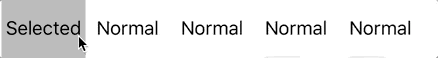

# Toggler
[](http://cocoapods.org/pods/Toggler)
[](https://github.com/Carthage/Carthage)
[](https://github.com/younatics/Toggler/blob/master/LICENSE)
[](http://cocoapods.org/pods/Toggler)
[](https://developer.apple.com/swift/)

## Intoduction
💡 don't further use `isSelected` to every button. use `Toggler` to simply control your buttons



#### Don't do like these any more
```Swift
    func buttonClicked(_ sender: UIButton) {
        switch sender.tag {
        case 0:
            button1.isSelected = true
            button2.isSelected = false
            button3.isSelected = false
            button4.isSelected = false
            button5.isSelected = false
        case 1:
            button1.isSelected = false
            button2.isSelected = true
            button3.isSelected = false
            button4.isSelected = false
            button5.isSelected = false
        case 2:
            button1.isSelected = false
            button2.isSelected = false
            button3.isSelected = true
            button4.isSelected = false
            button5.isSelected = false
        case 3:
            button1.isSelected = false
            button2.isSelected = false
            button3.isSelected = false
            button4.isSelected = true
            button5.isSelected = false
        case 4:
            button1.isSelected = false
            button2.isSelected = false
            button3.isSelected = false
            button4.isSelected = false
            button5.isSelected = true
        default:
            break
        }
    }
```

#### Use `Toggler`
```Swift 
func buttonClicked(_ sender: UIButton) {
    toggler.on(toggle: sender)
}
```
## Requirements

`Toggler` is written in Swift 3. Compatible with iOS 8.0+

## Installation

### Cocoapods

Toggler is available through [CocoaPods](http://cocoapods.org). To install
it, simply add the following line to your Podfile:

```ruby
pod 'Toggler'
```
### Carthage
```
github "younatics/Toggler"
```

## Usage
Init with `UIButton` or `UISwtich` and default index
```Swift 
toggler = Toggler(default: 0, togglers: [button1, button2, button3, button4, button5])
```

Toggle button
```Swift
toggler.on(toggle: sender)
toggler.onAt(index: sender.tag)
```

Add more button
```Swift 
toggler.add(toggle: button6)
```

Remove button
```Swift 
toggler.remove(at: 5)
```

## References
#### Please tell me or make pull request if you use this library in your application :) 

## Author
[younatics 🇰🇷](http://younatics.github.io)

## License
Toggler is available under the MIT license. See the LICENSE file for more info.
